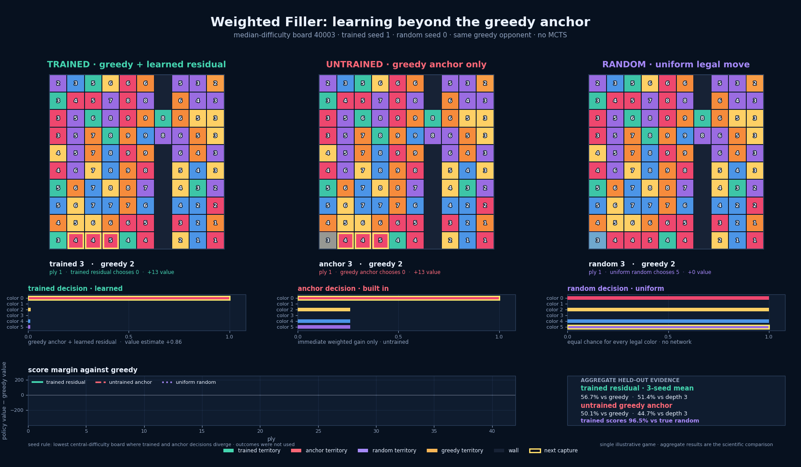

# Weighted Filler

Weighted Filler is a two-player 10x10 strategy environment for testing whether a compact AlphaZero-style policy can learn useful delayed decisions beyond immediate-value greedy play. Boards contain clustered cell values, a wall with two gates, six colors, and procedurally generated layouts.



The GIF compares a trained raw policy and a fresh network against the same greedy opponent on an identical held-out board, without MCTS. Board seed 40001 was selected before viewing either outcome because it is the first published final-test seed with two visibly separated gate cells. The animation is illustrative; the paired multi-seed evaluation below is the evidence for learning.

The project uses a depth-5 search teacher, a greedy-anchored residual policy, Gumbel MCTS self-play, and a replay buffer. The primary scientific target is the raw neural policy: it must beat random, greedy, and depth-3 search without MCTS at evaluation time.

## Current result

Three independent training seeds completed the frozen schedule. For each seed, the best checkpoint and gain scale were selected only on development boards and then evaluated over 1,000 paired held-out games per opponent using five fixed final-test board seeds. Playing each board from both sides removes first-player board bias.

| Training seed | Selected gain | Random | Greedy | Depth 3 |
| --- | ---: | ---: | ---: | ---: |
| 0 | 50 | 96.4% | 56.4% | 51.7% |
| 1 | 50 | 97.0% | 57.8% | 51.3% |
| 2 | 55 | 96.0% | 56.0% | 51.2% |
| mean | — | 96.5% | 56.7% | 51.4% |

Every independently trained policy beats greedy on the untouched games, with each paired 95% interval above 50%. All three depth-3 point estimates also exceed 50%; seed 0's interval is 50.3%–53.2%, while seeds 1 and 2 remain close enough that their individual intervals include 50%. This is reproducible evidence of learning, while the depth-3 advantage should be described as small rather than decisive across every seed.

The older included `weighted_filler_net.pt` checkpoint remains available for comparison. At its development-selected gain scale of 60 it scores 96.0%/57.6%/52.6% against random/greedy/depth 3, versus 50.1%/44.7% for a fresh untrained anchor against greedy/depth 3.

The combined machine-readable report is `results/three_seed_summary.json`. Reports for the older supplied checkpoint remain under `results/weighted_filler_net_*.json`.

Lightweight selected weights are published under `models/`; large resumable checkpoints remain local and are excluded by `.gitignore`.

## Setup

Python 3.9 or newer is recommended.

```bash
python3 -m venv .venv
source .venv/bin/activate
python3 -m pip install -r requirements.txt
```

Run the permanent tests:

```bash
python3 -m unittest discover -s tests -v
```

Generate the trained-versus-untrained board animation:

```bash
python3 visualize.py
```

Run a complete smoke training and evaluation outside the repository:

```bash
python3 train_az.py --preset smoke --seed 99 --output-dir /tmp/filler_smoke
python3 evaluate.py /tmp/filler_smoke/final_model.pt --games 20 --board-seeds 70001
```

## Reproduce training

The frozen full schedule uses 100 depth-5 teacher games, 10 teacher epochs, 12 expert-iteration rounds, eight self-play games per round, 150 Gumbel MCTS simulations per move, and four replay-training epochs per round.

Run the entire reproduction sequentially. Completed seeds are skipped, interrupted seeds resume automatically, and each completed seed is calibrated and evaluated before the combined report is rebuilt:

```bash
python3 run_reproduction.py --seeds 0 1 2
```

Each seed writes to `runs/seed_N/`:

- `config.json`: exact training configuration
- `metrics.jsonl`: teacher and iteration metrics
- `teacher_checkpoint.pt`: post-bootstrap resumable state
- `latest_checkpoint.pt`: latest resumable state
- `best_development_checkpoint.pt`: checkpoint selected only on development boards
- `final_model.pt`: plain model weights for evaluation
- `best_model.pt`: lightweight weights exported from the selected checkpoint

Run or resume one seed directly:

```bash
python3 train_az.py --seed 0 --output-dir runs/seed_0
python3 train_az.py --seed 0 --output-dir runs/seed_0 --resume runs/seed_0/latest_checkpoint.pt
```

## Held-out evaluation

Evaluate raw weights with the fixed official board seeds:

```bash
python3 evaluate.py weighted_filler_net.pt --games 1000 --output results/weighted_filler_net_raw.json
```

Evaluate the development-selected gain calibration and untrained control:

```bash
python3 evaluate.py weighted_filler_net.pt --games 1000 --gain-scale 60 --include-untrained --output results/weighted_filler_net_gain60_with_control.json
```

Do not tune architecture, checkpoint, or gain scale on these evaluation seeds. Development evaluation during training uses seed 10001; final evaluation defaults to board seeds 20001, 30001, 40001, 50001, and 60001.

## Project structure

| File | Role |
| --- | --- |
| `game.py` | immutable weighted game state, transitions, scoring, walls, and capture encoding |
| `baselines.py` | random, greedy, and score-search agents |
| `policy.py` | capture-equivariant greedy-residual policy-value network |
| `mcts_gumbel.py` | Gumbel MCTS policy improvement |
| `train_az.py` | teacher bootstrap, self-play, replay training, metrics, and resumable checkpoints |
| `evaluate.py` | paired held-out evaluation with board-pair bootstrap intervals |
| `calibrate.py` | development-only gain-scale selection |
| `run_reproduction.py` | sequential three-seed runner with automatic resume |
| `summarize_results.py` | combined report across official seed evaluations |
| `visualize.py` | trained-versus-untrained raw-policy board animation |
| `tests/test_core.py` | deterministic environment, augmentation, shape, and MCTS checks |

## Known limitation

The terminal `no_progress` counter is not included in the current 16-plane observation, so two otherwise identical positions can have different remaining turns. A diagnostic found this matters for a minority of positions but did not improve strength in a small training screen. It is disclosed rather than changed immediately because adding the plane would invalidate the supplied checkpoint and require a new architecture-wide reproduction.

## License

MIT
